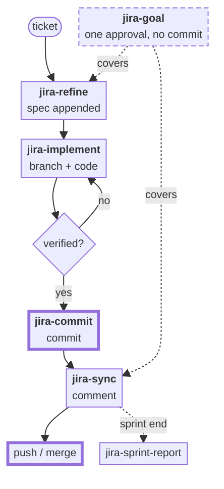
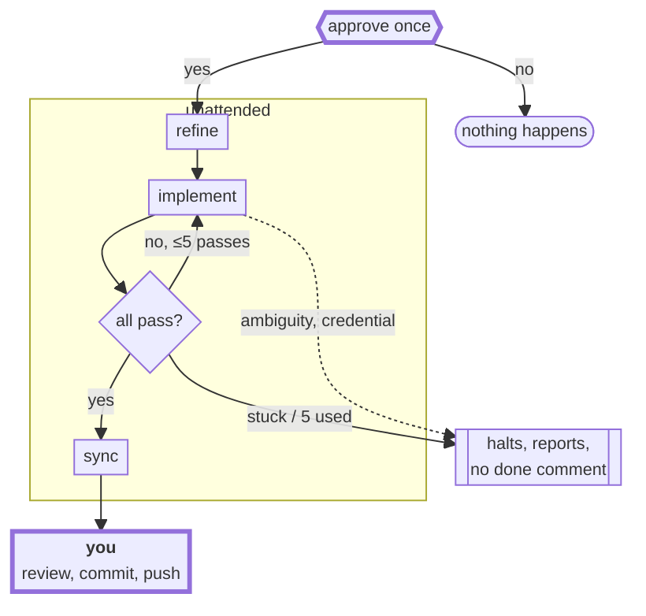

# jira-skills

English | [繁體中文](README.zh-TW.md)

Six skills for **Jira Server / Data Center**, built around the read-only Jira MCP server.

| Skill | Reads | Writes | One line |
|---|---|---|---|
| `jira-refine` | ticket + repo | ticket description | Appends a solution spec below the original text |
| `jira-implement` | ticket + repo | code | Branches and works the spec's solution steps |
| `jira-commit` | working tree | commit | Commits with a summary of the work, never pushes |
| `jira-sync` | git branch | ticket comment | Posts a ≤1000-char change summary |
| `jira-goal` | ticket + repo | description, code, comment | All of the above behind one approval, minus the commit |
| `jira-sprint-report` | sprint | local HTML file | Renders one person's sprint as a standalone report |

They follow the life of a ticket: `jira-refine` writes the plan, `jira-implement` builds it,
`jira-commit` commits it, `jira-sync` posts the write-up, and `jira-sprint-report` harvests
those same comments at the end of the sprint.

[Workflow](#workflow) · [Goal mode](#goal-mode-and-what-one-approval-buys) ·
[Install](#install) · [Setup](#setup) · [MCP server](#5-mcp-server) ·
[Not for Jira Cloud](#not-for-jira-cloud)

## Workflow

Step by step, one skill at a time. The two boxes with a thick border are yours — nothing in
this plugin commits or pushes for you:



Approvals along the way: `jira-refine` shows the new description before writing it,
`jira-commit` shows the message before committing, `jira-sync` shows the comment before
posting. `jira-goal` replaces those three prompts with a single one up front — its own
diagram is in the next section.

## Goal mode, and what one approval buys

`jira-goal` is the only skill that acts without asking per step. It asks once, up front, with
the exact list of writes it will make.

**What the approval covers** — one ticket, one run:

- appending the spec to the ticket description
- editing code on a new branch
- posting the summary comment

**What it never covers:** `git commit` and `git push`. The run ends with the changes
uncommitted in the working tree; reviewing and committing them is yours (`jira-commit` does
that once you have looked), and it is the last human gate before the code becomes history.
Because there are no commits, the summary comment is built from `git diff <mainline>` rather
than the commit log.

**What halts the run anyway**, approval or not:

- an ambiguous requirement — two readings, two different implementations
- a credential in the repo, the diff or the ticket
- work that needs another repo, another ticket, or a new dependency
- anything outward-facing: commit, push, merge, ticket transition, history rewrite

A stopped run reports; it does not post a "done" comment.

Both Jira writes stay recoverable: the original description is carried forward inside the new
one and the whole field is backed up to a file first, and a comment is only a comment.



## Not for Jira Cloud

Comment and description bodies here are **wiki markup** and auth is a **Personal Access
Token**. Jira Cloud uses ADF and email + API token for auth — `post-comment.sh` and
`update-description.sh` will not work against Cloud unchanged. The read paths (sprint
report) go through MCP and are more portable.

## Install

All six are plain [Agent Skills](https://developers.openai.com/codex/skills) — a directory
with a `SKILL.md`. Any agent that reads that format runs them. Only Claude Code uses the
marketplace; everywhere else it is a directory copy.

| Agent | Install | Also works |
|---|---|---|
| Claude Code | `claude plugin marketplace add shinn716/jira-skills`<br/>`claude plugin install jira-skills@jira-skills` | a local path instead of the repo name, or `skills/*` into `~/.claude/skills/` |
| OpenAI Codex | `cp -r skills/* ~/.codex/skills/` | `.agents/skills/` for one project; `/skills` lists, `$` mentions |
| opencode | `cp -r skills/* ~/.config/opencode/skills/` | reads `~/.claude/skills/` too — one copy serves both |

Clone first for the copy routes: `git clone https://github.com/shinn716/jira-skills`.
Restart the agent if a freshly copied skill does not show up.

**Cross-agent notes**

- **MCP tool names are written bare** (`jira_get_sprint_issues`), without Claude's
  `mcp__jira__` prefix. Each agent prefixes its own way; match on the suffix.
- **Codex sandboxes network by default**, so `post-comment.sh` and `update-description.sh`
  fail there — enable network access or approve the command. Reads through MCP are fine.
- Both scripts need `bash`, `curl` and `python` on PATH. On Windows, Git Bash.

## Setup

### 1. Create a token

Jira → avatar → **Profile** → **Personal Access Tokens** → *Create token*. Copy the value,
Jira shows it once. The token inherits your own permissions.

Server / Data Center 8.14+ only. Cloud's same menu gives an API token that authenticates as
`email:token` over Basic, not Bearer — see [Not for Jira Cloud](#not-for-jira-cloud).

### 2. Set two variables

`JIRA_URL` is the base URL, no trailing path (`/rest/...` is appended for you; a trailing
slash is stripped). `JIRA_PERSONAL_TOKEN` is the value from step 1. Both scripts exit with a
named error if either is missing.

Claude Code — the `env` block of **user-level** `~/.claude/settings.json`, which every Bash
call inherits. Never a project's `.claude/settings.json`; that one gets committed.

```json
{
  "env": {
    "JIRA_URL": "https://jira.example.com",
    "JIRA_PERSONAL_TOKEN": "NDU2..."
  }
}
```

Any shell — `~/.bashrc` / `~/.zshrc`:

```bash
export JIRA_URL=https://jira.example.com
export JIRA_PERSONAL_TOKEN=NDU2...
```

Windows PowerShell — `setx` writes the user environment, so **open a new terminal** after:

```powershell
setx JIRA_URL "https://jira.example.com"
setx JIRA_PERSONAL_TOKEN "NDU2..."
```

Optional `JIRA_COMMENT_MAX`: comment length cap in characters, default `1000`, `0` disables.
`post-comment.sh` refuses an over-long body rather than truncating it.

### 3. Check it

```bash
curl -s -H "Authorization: Bearer $JIRA_PERSONAL_TOKEN" \
  "$JIRA_URL/rest/api/2/myself" | head -c 200
```

| Result | Means |
|---|---|
| 200 + your account name | both variables are right |
| `401` | bad or expired token |
| `404` | `JIRA_URL` is not the Jira base URL — a context path like `/jira` is easy to drop |
| connection error | DNS, VPN or TLS, not auth |

The skills never write the token anywhere, but `settings.json` keeps it on disk in plaintext:
user-only permissions, out of any dotfiles repo or cloud-synced folder, out of `config.json`,
commit messages and Jira comments. Leaked → rotate it from the same Profile page.

### 4. jira-sprint-report only — a config file

Copy `skills/jira-sprint-report/config.example.json` to `config.json` beside it:

```json
{
  "jira_url": "https://jira.example.com",
  "board_id": "1234",
  "board_name": "My Scrum Board",
  "me": "your.jira.username"
}
```

No secrets in it — the report reads Jira through MCP. Gitignored, because the board id and
username are yours. Assignee resolution, first hit wins: CLI argument → `"me"` in the input
JSON → `JIRA_ME` → `config.json`, matched case-insensitively against the display name.

### 5. MCP server

All six skills read through an Atlassian MCP server, using the same URL and token as above:

```json
{
  "type": "stdio",
  "command": "uvx",
  "args": ["mcp-atlassian"],
  "env": {
    "JIRA_URL": "https://jira.example.com",
    "JIRA_PERSONAL_TOKEN": "...",
    "READ_ONLY_MODE": "true"
  }
}
```

Claude Code expands `${JIRA_URL}` / `${JIRA_PERSONAL_TOKEN}` in MCP config values, so if you
took the `settings.json` route above you can reference them here instead of pasting the token
a second time.

Codex wants the same server in `~/.codex/config.toml`:

```toml
[mcp_servers.jira]
command = "uvx"
args = ["mcp-atlassian"]
env = { JIRA_URL = "https://jira.example.com", JIRA_PERSONAL_TOKEN = "...", READ_ONLY_MODE = "true" }
```

opencode takes it under the `mcp` key of `opencode.json` (`"type": "local"`, `command` as an
argv array).

`READ_ONLY_MODE=true` is why `jira-sync` and `jira-refine` write over REST instead of through
MCP: a read-only server exposes no comment or update tool. Keeping it read-only means no skill
can mutate a ticket by accident — the write paths are two scripts that ask for confirmation
first, and `update-description.sh` backs up the old description before replacing it.

## Licence

MIT.
