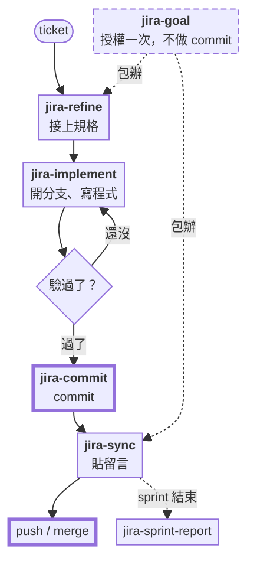
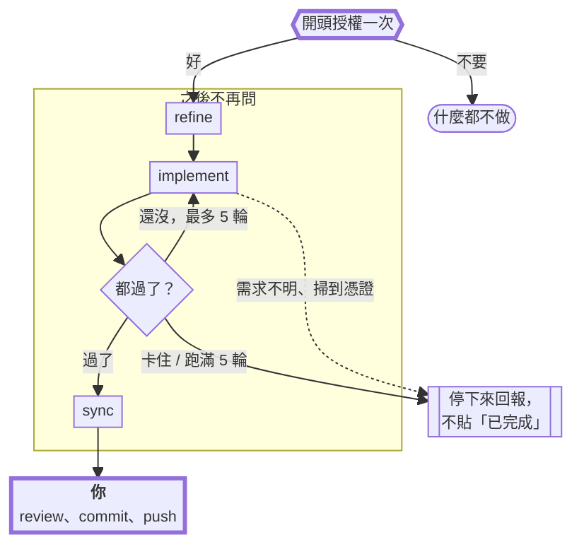

# jira-skills

繁體中文 | [English](README.md)

六個給 **Jira Server / Data Center** 用的 skill，都架在唯讀的 Jira MCP server 上。

| Skill | 讀 | 寫 | 一句話 |
|---|---|---|---|
| `jira-refine` | ticket、repo | ticket 描述 | 把解決方案規格接在原始描述下面 |
| `jira-implement` | ticket、repo | 程式碼 | 開分支，照規格的 Solution 一步步做 |
| `jira-commit` | working tree | commit | 用工作摘要 commit，不 push |
| `jira-sync` | git 分支 | ticket 留言 | 貼一份 1000 字元以內的變更摘要 |
| `jira-goal` | ticket、repo | 描述、程式碼、留言 | 授權一次跑完上面全部，但不含 commit |
| `jira-sprint-report` | sprint | 本機 HTML | 把某個人的 sprint 產出做成單檔報告 |

這六個是照著一張 ticket 的生命週期串起來的：`jira-refine` 先寫計畫，`jira-implement` 把它做出來，
`jira-commit` 負責 commit，`jira-sync` 貼上變更說明，`jira-sprint-report` 到 sprint 結束時再把這些
留言整理成報告。

[工作流程](#工作流程) · [Goal 模式](#goal-模式那一次授權到底給了什麼) ·
[安裝](#安裝) · [設定](#設定) · [MCP server](#5-mcp-server) ·
[不支援 Jira Cloud](#不支援-jira-cloud)

## 工作流程

一次跑一個 skill 的走法。粗框的兩個框是你自己要做的，這個 plugin 不會幫你 commit 或 push：



中間會問你的地方：`jira-refine` 寫入前會先給你看新的描述，`jira-commit` commit 前會先給你看
message，`jira-sync` 貼出去前會先給你看留言。`jira-goal` 則是把這三次詢問換成一開始問一次，
它自己的流程圖在下一節。

## Goal 模式：那一次授權到底給了什麼

`jira-goal` 是唯一一個不會每做一步就問你的 skill。它只在最前面問一次，而且會先把接下來要寫入的
動作全部列出來。

**這次授權涵蓋什麼** —— 只算一張 ticket、一次執行：

- 把規格接在 ticket 描述下面
- 在新分支上改程式碼
- 貼出摘要留言

**永遠不包含的：`git commit` 和 `git push`。** 跑完之後改動會留在 working tree，要不要 commit
由你自己 review 後決定（看過之後可以用 `jira-commit` 來 commit），這是程式碼進到 git 歷史前
最後一道人工關卡。也因為沒有 commit，摘要留言是拿 `git diff <mainline>` 生出來的，不是讀
commit log。

**不管有沒有授權，這些狀況一律停下來：**

- 需求有兩種以上解讀，而且會寫出不同的程式碼
- repo、diff 或 ticket 裡出現憑證
- 這件事得動到別的 repo、別的 ticket，或要加新的相依套件
- 任何對外或破壞性的動作：commit、push、merge、轉 ticket 狀態、改寫歷史

中途停下來的執行只會回報現況，不會貼「已完成」的留言。

兩種寫入 Jira 的動作都救得回來：提單人原本寫的描述會原封不動帶到新的描述裡，寫入前還會把
整個欄位備份成檔案，留言本來就只是留言。



## 不支援 Jira Cloud

這裡的留言和描述都是 **wiki markup**，驗證用的是 **Personal Access Token**。Jira Cloud 用的是
ADF，驗證是 email 加 API token，所以 `post-comment.sh` 和 `update-description.sh` 不改的話在
Cloud 上跑不動。讀取的部分（sprint 報告）走 MCP，比較不挑環境。

## 安裝

這六個都是單純的 [Agent Skills](https://developers.openai.com/codex/skills)：一個資料夾放一份
`SKILL.md`。只要看得懂這個格式的 agent 都跑得起來。只有 Claude Code 用得到 plugin
marketplace，其他就是複製資料夾。

| Agent | 安裝 | 另外也可以 |
|---|---|---|
| Claude Code | `claude plugin marketplace add shinn716/jira-skills`<br/>`claude plugin install jira-skills@jira-skills` | 用本機路徑代替 repo 名稱，或把 `skills/*` 複製到 `~/.claude/skills/` |
| OpenAI Codex | `cp -r skills/* ~/.codex/skills/` | 限定單一專案就放 `.agents/skills/`；`/skills` 列出、`$` 指定 |
| opencode | `cp -r skills/* ~/.config/opencode/skills/` | 也吃 `~/.claude/skills/`，一份給兩個 agent |

走複製那兩條要先 clone：`git clone https://github.com/shinn716/jira-skills`。
剛複製好的 skill 沒出現的話，重開 agent 就會看到。

**跨 agent 要注意的地方**

- **MCP tool 名稱都是寫原名**（像 `jira_get_sprint_issues`），沒加 Claude 的 `mcp__jira__`
  前綴。每個 agent 加前綴的方式不一樣，比對後半段就好。
- **Codex 預設不給連網**，所以 `post-comment.sh` 和 `update-description.sh` 在預設沙箱下會失敗，
  要開網路權限或在詢問時按核准。走 MCP 的讀取不受影響。
- 兩支 script 需要 PATH 上有 `bash`、`curl`、`python`。Windows 上請用 Git Bash。

## 設定

### 1. 先申請 token

Jira 右上角頭像 → **Profile** → **Personal Access Tokens** → *Create token*。把值複製起來，
Jira 只會顯示這一次。token 的權限跟你本人一樣。

這是 Jira **Server / Data Center**（8.14 以上）才有的功能。Cloud 同一個選單給的是 API token，
走 Basic 的 `email:token` 而不是 Bearer，看[不支援 Jira Cloud](#不支援-jira-cloud)。

### 2. 設兩個環境變數

`JIRA_URL` 填 base URL 就好，後面不要接路徑（`/rest/...` 由 script 自己補，結尾斜線會幫你去掉），
`JIRA_PERSONAL_TOKEN` 就是上一步複製的值。少一個，兩支 script 都會直接報錯結束。

Claude Code 寫在**使用者層級** `~/.claude/settings.json` 的 `env` 區塊，每次呼叫 Bash tool 都會
繼承。不要放專案裡的 `.claude/settings.json`，那個會被 commit 上去。

```json
{
  "env": {
    "JIRA_URL": "https://jira.example.com",
    "JIRA_PERSONAL_TOKEN": "NDU2..."
  }
}
```

任何 shell —— 寫進 `~/.bashrc` 或 `~/.zshrc`：

```bash
export JIRA_URL=https://jira.example.com
export JIRA_PERSONAL_TOKEN=NDU2...
```

Windows PowerShell —— `setx` 寫的是使用者環境變數，設完要**開一個新的終端機**：

```powershell
setx JIRA_URL "https://jira.example.com"
setx JIRA_PERSONAL_TOKEN "NDU2..."
```

選用的 `JIRA_COMMENT_MAX`：留言字元數上限，預設 `1000`，填 `0` 不檢查。`post-comment.sh` 超過
就拒絕送出，不會幫你截斷。

### 3. 確認有沒有設對

```bash
curl -s -H "Authorization: Bearer $JIRA_PERSONAL_TOKEN" \
  "$JIRA_URL/rest/api/2/myself" | head -c 200
```

| 結果 | 代表 |
|---|---|
| 200 加自己的帳號名稱 | 兩個變數都對 |
| `401` | token 錯了或過期 |
| `404` | `JIRA_URL` 指到的不是 base URL，像 `/jira` 這種 context path 最容易漏掉 |
| 連不上 | DNS、VPN 或 TLS，跟驗證無關 |

skill 本身不會把 token 寫到任何地方，但 `settings.json` 會讓它明文躺在硬碟上：權限只留給自己，
別放進 dotfiles repo 或雲端同步資料夾，也別寫進 `config.json`、commit message、Jira 留言。
外流的話，到同一個 Profile 頁面重新產生一組。

### 4. 只有 jira-sprint-report 要的設定檔

把 `skills/jira-sprint-report/config.example.json` 複製成同一層的 `config.json`：

```json
{
  "jira_url": "https://jira.example.com",
  "board_id": "1234",
  "board_name": "My Scrum Board",
  "me": "your.jira.username"
}
```

裡面沒有機密，報告是透過 MCP 讀 Jira。有被 gitignore，因為 board id 和帳號是你自己的。
要用誰的資料，先找到先算：CLI 參數 → 輸入 JSON 的 `"me"` → `JIRA_ME` → `config.json`，
比對顯示名稱時不分大小寫。

### 5. MCP server

六個 skill 讀資料都是走 Atlassian MCP server，用的是跟上面同一組 URL 和 token：

```json
{
  "type": "stdio",
  "command": "uvx",
  "args": ["mcp-atlassian"],
  "env": {
    "JIRA_URL": "https://jira.example.com",
    "JIRA_PERSONAL_TOKEN": "...",
    "READ_ONLY_MODE": "true"
  }
}
```

Claude Code 會展開 MCP 設定值裡的 `${JIRA_URL}` 和 `${JIRA_PERSONAL_TOKEN}`，所以如果你是走
上面 `settings.json` 那條路，這裡直接引用就好，不用再貼一次 token。

Codex 是把同一個 server 寫在 `~/.codex/config.toml`：

```toml
[mcp_servers.jira]
command = "uvx"
args = ["mcp-atlassian"]
env = { JIRA_URL = "https://jira.example.com", JIRA_PERSONAL_TOKEN = "...", READ_ONLY_MODE = "true" }
```

opencode 則是放在 `opencode.json` 的 `mcp` 底下（`"type": "local"`，`command` 用 argv 陣列）。

`READ_ONLY_MODE=true` 就是為什麼 `jira-sync` 和 `jira-refine` 是走 REST 而不是走 MCP 寫入：
唯讀的 server 根本不會開留言或更新的 tool。維持唯讀的好處是不會有 skill 不小心改到 ticket，
會寫入的就只有那兩支 script，而且都會先要你確認，`update-description.sh` 還會在寫入前把整個
描述欄位備份起來。

## 授權條款

MIT。
