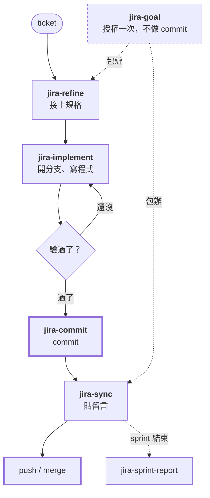
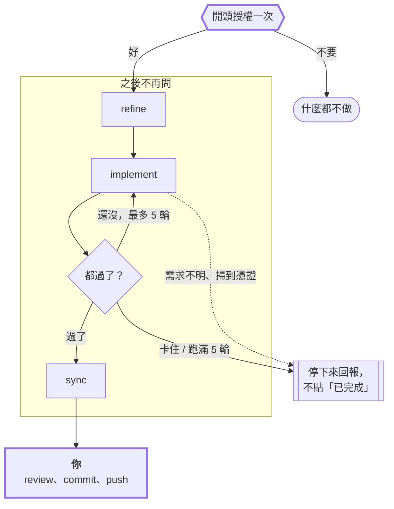

# jira-skills

繁體中文 | [English](README.md)

六個給 **Jira Server / Data Center** 用的 skill，都架在唯讀的 Jira MCP server 上：

| Skill | 用途 |
|---|---|
| `jira-refine` | 讀 ticket 的標題和描述，分析這個 repo，再把解決方案規格（表格、編號流程、條列）接在原本的描述下面。原始描述一字不改，放在最上面的 `h2. Original Request`，寫入前還會先備份整個欄位。 |
| `jira-implement` | 讀 ticket（如果已經有 `jira-refine` 整理過的規格就照著做），開分支、把 Solution 一步步寫成程式碼，再對照 Acceptance Criteria 驗證。只動 repo，不會寫回 Jira。 |
| `jira-commit` | 讀 working tree 的改動，寫一則摘要「做了什麼」（而不是複述 diff）的 commit message，commit 完再接著跑 `jira-sync`。不會 push。 |
| `jira-sync` | 讀目前的 git 分支，用 Jira wiki markup 寫一份 1000 字元以內的變更摘要，貼到分支對應的 ticket 留言（`feature/PROJ-123` 對到 `PROJ-123`）。 |
| `jira-goal` | Goal 模式：一開始授權一次，之後就自己跑完 refine、implement、反覆修到每條 Acceptance Criteria 都過，最後貼上摘要。遇到需求不明確、掃到憑證、或任何對外的動作就停下來。 |
| `jira-sprint-report` | 抓一個 sprint，把某個人的產出做成單一個 HTML 檔：統計、SVG 圖表、可排序和過濾的 issue 表格、每張結案 ticket 的文字摘要，還有團隊比較區塊。 |

這六個是照著一張 ticket 的生命週期串起來的：`jira-refine` 先寫計畫，`jira-implement` 把它做出來，
`jira-commit` 負責 commit，`jira-sync` 貼上變更說明，`jira-sprint-report` 到 sprint 結束時再把這些
留言整理成報告。`jira-goal` 則是把 refine、implement、sync 包在同一次授權裡跑完。

## 工作流程

一次跑一個 skill 的走法。粗框的兩個框是你自己要做的，這個 plugin 不會幫你 commit 或 push：



中間會問你的地方：`jira-refine` 寫入前會先給你看新的描述，`jira-commit` commit 前會先給你看
message，`jira-sync` 貼出去前會先給你看留言。`jira-goal` 則是把這三次詢問換成一開始問一次，
它自己的流程圖在下一節。

## Goal 模式：那一次授權到底給了什麼

`jira-goal` 是唯一一個不會每做一步就問你的 skill。它只在最前面問一次，而且會先把接下來要寫入的
動作全部列出來。這次授權只算 **一張 ticket、一次執行**，範圍是三件事：把規格接在描述下面、在新分支上改
程式碼、貼出摘要留言。

**`git commit` 和 `git push` 永遠不包含在裡面。** 跑完之後改動會留在 working tree，要不要
commit 由你自己 review 後決定（看過之後可以用 `jira-commit` 來 commit），這是程式碼進到 git
歷史前最後一道人工關卡。也因為沒有 commit，摘要留言是拿 `git diff <mainline>` 生出來的，
不是讀 commit log。

不管有沒有授權，碰到下面這些狀況一律停下來：需求有兩種以上解讀而且會寫出不同的程式碼、repo 或
ticket 裡出現憑證、這件事得動到別的 repo 或別的 ticket、任何對外或破壞性的動作（commit、push、
merge、轉 ticket 狀態、改寫歷史）。中途停下來的執行只會回報現況，不會貼「已完成」的留言。

兩種寫入 Jira 的動作都救得回來：提單人原本寫的描述會原封不動帶到新的描述裡，寫入前還會把
整個欄位備份成檔案，留言本來就只是留言。



## 不支援 Jira Cloud

這裡的留言和描述都是 **wiki markup**，驗證用的是 **Personal Access Token**。Jira Cloud 用的是
ADF，驗證是 email 加 API token，所以 `post-comment.sh` 和 `update-description.sh` 不改的話在
Cloud 上跑不動。讀取的部分（sprint 報告）走 MCP，比較不挑環境。

## 安裝

這六個都是單純的 [Agent Skills](https://developers.openai.com/codex/skills)：一個資料夾，裡面放
一份有 `name` 和 `description` 的 `SKILL.md`。只要看得懂這個格式的 agent 都跑得起來。只有
Claude Code 這條路會用到 plugin marketplace，其他就是複製資料夾而已。

### Claude Code

```bash
claude plugin marketplace add shinn716/jira-skills
claude plugin install jira-skills@jira-skills
```

也可以先 clone 下來再加本機路徑（`claude plugin marketplace add /path/to/jira-skills`），
或是直接把 `skills/*` 複製到 `~/.claude/skills/`。

### OpenAI Codex

```bash
git clone https://github.com/shinn716/jira-skills
cp -r jira-skills/skills/* ~/.codex/skills/
```

想限定在單一專案的話，複製到 `.agents/skills/` 再 commit 進去。用 `/skills` 可以列出來，
`$` 可以指定其中一個。剛複製好的 skill 沒出現的話，重開 Codex 就會看到。

### opencode

```bash
cp -r jira-skills/skills/* ~/.config/opencode/skills/
```

opencode 也吃 Claude 那套路徑，所以放在 `~/.claude/skills/` 或專案的 `.claude/skills/` 都能直接用，
一份就同時給兩個 agent 吃。

### 跨 agent 要注意的地方

- **skill 裡的 MCP tool 名稱都是寫原名**（像 `jira_get_sprint_issues`），沒有加 Claude 的
  `mcp__jira__` 前綴。每個 agent 加前綴的方式不一樣，比對後半段就好。
- **Codex 預設不給連網。** `post-comment.sh` 和 `update-description.sh` 要走 HTTPS 連 Jira，
  在預設的沙箱下會失敗，記得開網路權限，或是在跳出詢問時按核准。sprint 報告不受影響，它是透過
  MCP 讀資料，`render.py` 也只寫本機檔案。
- **`render.py` 只需要 Python 3**，沒有其他相依套件，所以在哪跑都一樣。
- 兩支 script 需要 PATH 上有 `bash`、`curl`、`python`。Windows 上請用 Git Bash。

## 設定

### JIRA_URL 和 JIRA_PERSONAL_TOKEN

`post-comment.sh` 和 `update-description.sh` 都是從環境變數讀這兩個值，少一個就會直接報錯結束。
MCP server 要的也是同一組（見下面）。

**1. 先申請 token。** Jira 右上角頭像 → **Profile** → **Personal Access Tokens** →
*Create token*。取個名字、設到期日，然後把值複製起來，Jira 只會顯示這一次。token 的權限跟你本人
一樣，所以你能留言的 ticket 它才留得了言。

Personal Access Token 是 Jira **Server / Data Center**（8.14 以上）的功能。Jira Cloud 同一個
選單給的是 API token，走的是 Basic 的 `email:token` 而不是 Bearer，細節看上面「不支援 Jira Cloud」。

**2. 設環境變數。** `JIRA_URL` 填 base URL 就好，後面不要接路徑，`/rest/...` 由 script 自己補。
結尾多打斜線也沒關係，會幫你去掉。

用 Claude Code 的話最省事的是寫在 **`~/.claude/settings.json`** 的 `env` 區塊。每次呼叫 Bash
tool 都會繼承這組變數，所以 `post-comment.sh` 在任何專案都能用，不用去動 shell profile：

```json
{
  "env": {
    "JIRA_URL": "https://jira.example.com",
    "JIRA_PERSONAL_TOKEN": "NDU2..."
  }
}
```

如果原本就有 `env` 就併進去，改完重開 Claude Code。記得要放在 **使用者層級** 的
`~/.claude/settings.json`，不要放專案裡的 `.claude/settings.json`，那個檔案會被 commit 上去。
反正 token 兩種放法都是明文，把這個檔當成 SSH key 看待就對了：權限只留給自己，也不要同步進任何 repo。

用其他 agent，或是不想把 token 放在設定檔裡的話，就設 shell 環境變數，寫進
`~/.bashrc` 或 `~/.zshrc`：

```bash
export JIRA_URL=https://jira.example.com
export JIRA_PERSONAL_TOKEN=NDU2...          # 剛剛複製的那組值
```

Windows 用 PowerShell 的話，`setx` 是寫進使用者環境變數，所以設定完要**開一個新的終端機**才會生效：

```powershell
setx JIRA_URL "https://jira.example.com"
setx JIRA_PERSONAL_TOKEN "NDU2..."
```

**3. 確認有沒有設對。** 回 200 而且看得到自己的帳號名稱，就代表兩個變數都沒問題：

```bash
curl -s -H "Authorization: Bearer $JIRA_PERSONAL_TOKEN" \
  "$JIRA_URL/rest/api/2/myself" | head -c 200
```

出現 `401` 是 token 錯了或過期。這裡出現 `404` 表示 `JIRA_URL` 指到的不是 Jira 的 base URL，
像 `/jira` 這種 context path 最容易漏掉。連不上則是 DNS、VPN 或 TLS 的問題，跟驗證無關。

**選用的 `JIRA_COMMENT_MAX`。** 用字元數限制留言長度，預設 `1000`，填 `0` 就不檢查。設法跟上面
兩個一樣。`post-comment.sh` 算的是字元數（中文一個字算一個），超過就直接拒絕送出，不會幫你截斷。

skill 本身不會把 token 寫到任何地方，但上面 `settings.json` 那條路確實會讓它明文躺在硬碟上，
所以那個檔案的權限只留給自己，也別放進 dotfiles repo 或雲端同步的資料夾。另外 token 不要寫進
`config.json`、不要出現在 commit message、也不要貼進 Jira 留言。萬一外流，就到同一個 Profile
頁面重新產生一組。

### jira-sprint-report 要一個設定檔

把 `skills/jira-sprint-report/config.example.json` 複製成同一層的 `config.json`：

```json
{
  "jira_url": "https://jira.example.com",
  "board_id": "1234",
  "board_name": "My Scrum Board",
  "me": "your.jira.username"
}
```

這裡面沒有機密，sprint 報告是透過 MCP server 讀 Jira，憑證由 MCP server 自己保管。
`config.json` 有被 gitignore，因為 board id 和帳號是你自己的。

要用誰的資料，順序是先找到先算：CLI 參數 → 輸入 JSON 裡的 `"me"` → `JIRA_ME` → `config.json`。
比對方式是拿去跟顯示名稱做不分大小寫的子字串比對，所以 `jane.doe` 會對到 `jane.doe Jane Doe`。

### MCP server

六個 skill 讀資料都是走 Atlassian MCP server，用的是跟上面同一組 URL 和 token：

```json
{
  "type": "stdio",
  "command": "uvx",
  "args": ["mcp-atlassian"],
  "env": {
    "JIRA_URL": "https://jira.example.com",
    "JIRA_PERSONAL_TOKEN": "...",
    "READ_ONLY_MODE": "true"
  }
}
```

Claude Code 會展開 MCP 設定值裡的 `${JIRA_URL}` 和 `${JIRA_PERSONAL_TOKEN}`，所以如果你是走
上面 `settings.json` 那條路，這裡直接引用就好，不用再貼一次 token。

Codex 是把同一個 server 寫在 `~/.codex/config.toml`：

```toml
[mcp_servers.jira]
command = "uvx"
args = ["mcp-atlassian"]
env = { JIRA_URL = "https://jira.example.com", JIRA_PERSONAL_TOKEN = "...", READ_ONLY_MODE = "true" }
```

opencode 則是放在 `opencode.json` 的 `mcp` 底下（`"type": "local"`，`command` 用 argv 陣列）。

`READ_ONLY_MODE=true` 就是為什麼 `jira-sync` 和 `jira-refine` 是走 REST 而不是走 MCP 寫入：
唯讀的 server 根本不會開留言或更新的 tool。維持唯讀的好處是不會有 skill 不小心改到 ticket，
會寫入的就只有那兩支 script，而且都會先要你確認，`update-description.sh` 還會在寫入前把整個
描述欄位備份起來。

## 自己手動產報告

`render.py` 不需要裝任何套件，只用 Python 3 標準函式庫。

```bash
python skills/jira-sprint-report/render.py sprint.json out.html ["Assignee Name"]
```

輸入的 JSON 是 MCP 原始的 issue 物件，再加上一個 `sprint` 區塊；每張 issue 可以選填
`work_summary`，那就是顯示在該列底下的內容。同一份資料要換一個人重出報告，一行指令就好。

`sample-sprint.json` 是可以直接跑、完全不用連 Jira 的範例：

```bash
python skills/jira-sprint-report/render.py \
  skills/jira-sprint-report/sample-sprint.json out.html
python skills/jira-sprint-report/test_render.py   # 同一份檔案，拿來當 smoke test
```

## ticket 裡的機密怎麼處理

大家很習慣把金鑰、token、連線字串直接貼進 Jira 留言。這六個 skill 都被要求只描述「這件事」
（例如「簽章金鑰已更換」），絕對不把值本身複製進報告或新留言。如果在 ticket 裡看到還有效的憑證，
skill 會直接告訴你，而不是默默地把它再傳一手出去。

## 幾個容易踩的雷

- **「Done」是 status category，不是狀態名稱。** 像 `Terminated`、`Closed` 這種自訂狀態也算在
  `Done` 這個 category 裡。只用名稱去比對會少算。
- **Sprint 的 issue API 一頁最多 50 筆。** 兩個 skill 都會一直翻頁翻到 `total` 為止；少抓一頁，
  報告裡每個百分比都會偏掉，而且看不出來。
- **留言串常常自己打自己臉。** 後面的留言很常推翻前面的結論。所以摘要是讀整串，而不是挑最長的
  那則，最長的通常正好就是被推翻的那則。

## 授權條款

MIT。
